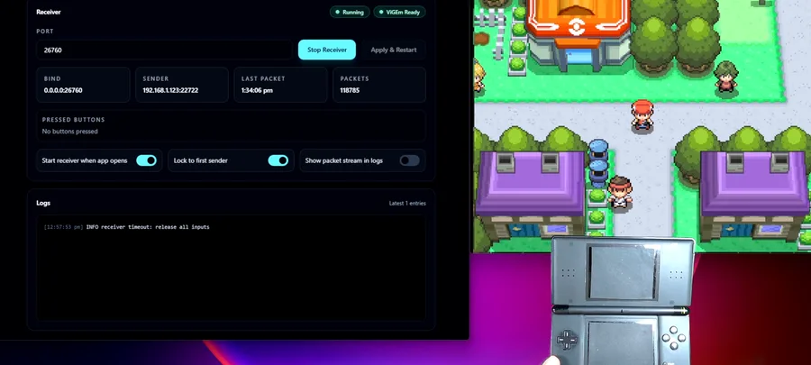

# 🎮 DS Controller

[](https://github.com/git-blame-dev/ds-controller/actions/workflows/ci.yml)
[](https://github.com/git-blame-dev/ds-controller/releases/latest)
[](https://github.com/git-blame-dev/ds-controller/releases/latest)
[](https://github.com/git-blame-dev/ds-controller/releases/latest)

Use a Nintendo DS or DS Lite as a Wi-Fi controller for most Windows PC games through virtual Xbox 360 controller output.



## 🔎 Overview

DS Controller turns original Nintendo DS-family hardware into a wireless game controller for Windows PC players who want to reuse real DS hardware with standard controller-compatible games. The DS homebrew app reads the handheld's buttons and sends compact UDP controller-state packets over Wi-Fi; the Windows receiver maps those packets to a ViGEm virtual Xbox 360 controller so compatible games see standard controller input.

The project includes both sides of the system: a Nintendo DS ROM for the sender and a portable dark desktop dashboard for the Windows receiver.

## ✨ Features

- Use Nintendo DS / DS Lite buttons as Windows gamepad input over local Wi-Fi.
- Output through a virtual Xbox 360 controller for broad XInput game compatibility.
- Configure the receiver UDP port from the PC dashboard and restart the receiver without relaunching the app.
- View receiver status, ViGEm status, packet debugging, and logs in one desktop window.
- Configure the DS target PC from `ds-controller.ini`, with build-time defaults available for fixed setups.
- Keep the DS display mostly off during play; touch wakes the status screen briefly.

## 🛠️ Tech Stack

- **Nintendo DS ROM:** C homebrew built with devkitPro, devkitARM, libnds, and dswifi.
- **Windows receiver backend:** Rust, UDP socket handling, ViGEm virtual controller integration.
- **Desktop UI:** Tauri 2, React 19, TypeScript, Vite, and pnpm.
- **Build / release tooling:** Make targets for deterministic tests, DS ROM builds, Dockerized devkitARM builds, and Linux-first Windows cross-builds.
- **CI / artifacts:** GitHub Actions release workflow with Windows app files, the NDS ROM, and example configuration.

## 🧠 Engineering Highlights

- Splits the system at a small UDP packet boundary: the DS only sends button state, while the PC owns filtering, timeout behavior, and virtual controller output.
- Uses ViGEm to expose a virtual Xbox 360 controller, which targets Windows games that support XInput rather than requiring per-game keyboard mapping.
- Supports both runtime DS configuration via `ds-controller.ini` and optional build-time defaults through `build.mk` for flashcart workflows.
- Keeps hardware-specific behavior explicit: Wi-Fi association, backlight control, and virtual controller runtime behavior still require real DS / Windows hardware to validate.
- Uses a Linux-first workflow for deterministic checks and cross-building portable Windows receiver artifacts.

## 🏗️ Architecture

```text
Nintendo DS / DS Lite
  buttons -> UDP packets at 60 Hz
        |
        v
Windows PC receiver
  parse -> filter -> timeout -> ViGEm virtual Xbox 360 output
        |
        v
Windows PC game using XInput
```

The DS sender is intentionally small: it connects to a DS-compatible Wi-Fi profile, reads button input, and sends controller packets to the configured PC LAN IP and UDP port.

The Windows app receives packets, updates the dashboard, handles receiver lifecycle controls, and writes controller state through ViGEm. This means game compatibility depends on Windows, ViGEmBus, and whether the target game accepts Xbox 360 / XInput controllers.

Key directories:

- `nds/` - Nintendo DS sender, homebrew build files, DS-side config example, and host-side tests.
- `pc/receiver/` - Rust receiver logic for UDP packet handling and controller output boundaries.
- `pc/app/` - Tauri/React desktop dashboard for receiver status, controls, and logs.
- `scripts/` - build and packaging helpers for the Linux-first Windows app workflow.

## 🚀 Getting Started

### Prerequisites

Runtime:

- Nintendo DS or DS Lite.
- Flashcart or compatible homebrew loader.
- Windows PC on the same LAN as the DS.
- [ViGEmBus](https://github.com/nefarius/ViGEmBus/releases) installed on Windows.
- DS-compatible 2.4 GHz Wi-Fi network.

Build tooling:

- Rust toolchain.
- Node.js and pnpm for the Tauri GUI frontend.
- Tauri 2 system prerequisites for Windows app builds.
- `cargo-xwin` or native Windows tooling for Windows Rust validation.
- [devkitPro](https://devkitpro.org/wiki/Getting_Started) with devkitARM, libnds, and dswifi for building the DS sender.
- Docker for building the DS sender with the pinned devkitARM image used by CI.

### DS Wi-Fi setup

A DS-compatible Wi-Fi network means an old-style 2.4 GHz `802.11b` network using open or WEP security. DS / DS Lite cannot connect to WPA, WPA2, WPA3, or 5 GHz networks.

Configure the Wi-Fi profile first from a Nintendo WFC-compatible DS game, such as Mario Kart DS or a Generation 4 Pokemon game, then launch the DS sender. Use a dedicated isolated network if you use open or WEP.

### Configure the DS target PC

The DS ROM can read a `ds-controller.ini` file from these flashcart paths:

- `ds-controller.ini`
- `/ds-controller.ini`
- `/ds-controller/ds-controller.ini`

```ini
pc_ip=192.168.1.50
pc_port=26760
```

Use [`nds/ds-controller.ini`](nds/ds-controller.ini) as a starting point. Set `pc_ip` to the Windows receiver PC's LAN IP address. Leave `pc_port` as `26760` unless that port is already in use or you changed the PC receiver port. If no config file is found, the ROM uses the build-time defaults.

Optional build-time configuration:

```sh
cp build.example.mk build.mk
```

Copy [`build.example.mk`](build.example.mk), then edit `build.mk`:

```make
PC_IP := 192.168.1.50
PC_PORT := 26760
```

`build.mk` is ignored by Git because it is local network configuration. It is optional when using `ds-controller.ini`.

### Build locally

Install the PC app tooling once from the repo root:

```sh
pnpm install --frozen-lockfile
```

Build the DS ROM:

```sh
make nds
```

The default `make nds` target uses Docker with the same pinned devkitARM image as CI when devkitPro is not installed locally.

Cross-build the Windows PC GUI app from Linux:

```sh
make pc
```

`make pc` requires LLVM tools, `cargo-xwin`, and the Windows MSVC Rust target:

```sh
rustup target add x86_64-pc-windows-msvc
cargo install cargo-xwin
```

Install LLVM tools with one of:

```sh
# Ubuntu / WSL
sudo apt install clang lld llvm

# CachyOS / Arch
sudo pacman -S --needed clang lld llvm
```

### Run

Copy `ds-controller.exe` and the matching `WebView2Loader.dll` to the same folder on the Windows PC, then run `ds-controller.exe`. The receiver starts automatically when **Start receiver when app opens** is enabled. You can change the UDP port, use **Apply & Restart**, and view receiver logs in the app.

Then launch `nds/build/ds-controller.nds` on the DS.

The DS screen shows Wi-Fi connection progress. After connecting, the top screen turns off and the bottom screen stays off until touched. Touch wakes the status screen briefly; normal button input does not wake it.

## ✅ Testing

Run all deterministic tests:

```sh
make test
```

For a manual PC GUI smoke check, run the app in development mode:

```sh
make app-dev
```

Lean local workflow: `make test` validates the code; `make pc` produces the Windows executable.

CI runs `make test`, cross-builds the Windows PC app with `make pc`, and builds the NDS ROM; real DS / Windows hardware behavior is still manual validation.

The DS host tests cover packet encoding, input mapping, and display wake policy. Hardware behavior such as Wi-Fi association, backlight control, WebView2 startup, ViGEmBus integration, firewall prompts, and XInput output still requires real DS / Windows hardware.

## 📦 Releases / Artifacts

[GitHub Releases](https://github.com/git-blame-dev/ds-controller/releases) publish a complete zip containing the Windows app files, NDS ROM, and `ds-controller.ini`.

For local builds and manual Windows testing, artifacts are staged at:

- DS ROM: `nds/build/ds-controller.nds`
- Windows executable: `pc/target/x86_64-pc-windows-msvc/release/ds-controller.exe`
- WebView2 loader DLL: `pc/target/x86_64-pc-windows-msvc/release/build/webview2-com-sys-*/out/x64/WebView2Loader.dll`

When testing manually on Windows, copy `ds-controller.exe` and `WebView2Loader.dll` into the same folder. CI runs the same Linux-first `make test` / `make pc` workflow and stages both files in the `ds-controller-pc-app` artifact.

## ⚠️ Limitations

- Windows game compatibility is limited to games that accept Xbox 360 / XInput controllers through the virtual controller layer.
- Controller input is button-only; touchscreen input is used only to wake the status screen.
- DS / DS Lite Wi-Fi requires open or WEP-era 2.4 GHz networking.
- Do not connect open or WEP Wi-Fi to your main network; use an isolated network segment for DS testing.
- ViGEmBus is required for virtual Xbox 360 output on Windows.
- End-to-end hardware behavior still needs validation on an actual DS or DS Lite and a Windows PC with the built receiver.

## 🧯 Troubleshooting

- **ViGEm error:** install ViGEmBus, then restart DS Controller.
- **Port already in use:** choose a different port in the app and click **Apply & Restart**.
- **No packets received:** confirm the DS is using the Windows PC's LAN IP address and the same UDP port shown in the app.
- **Sender config changes do not apply:** if you use build-time defaults, rebuild the ROM after changing `build.mk`; if you use `ds-controller.ini`, confirm the file is on one of the supported flashcart paths.
- **UDP traffic is blocked:** allow DS Controller to receive UDP traffic on the selected port.
- **DS Wi-Fi issue:** confirm the network is 2.4 GHz `802.11b` with open or WEP security, and configure the Wi-Fi profile from a Nintendo WFC-compatible DS game before launching the sender.
- **Game does not respond:** confirm ViGEmBus is installed and that the game accepts Xbox 360 / XInput controllers.
